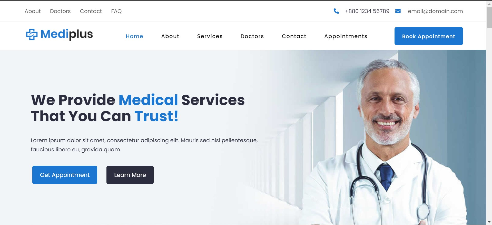

<a id="readme-top"></a>


<!-- PROJECT LOGO -->
<br />
<div align="center">
  <a href="https://github.com/dugsiiyeinc/mediplus-P">
    
  </a>

  <h3 align="center">Medi-plua project for health centers</h3>

  <p align="center">
    <a href="https://github.com/dugsiiyeinc/mediplus-P"><strong>Explore the docs »</strong></a>
    <br />
    <a href="mediplus-p.vercel.app">View Demo</a>
  </p>
</div>

<details>
  <summary>Table of Contents</summary>
  <ol>
    <li>
      <a href="#about-the-project">About The Project</a>
      <ul>
        <li><a href="#built-with">Built With</a></li>
      </ul>
    </li>
    <li>
      <a href="#getting-started">Getting Started</a>
    </li>
    <li><a href="#usage">Usage</a></li>
    <li><a href="#contributing">Contributing</a></li>
    <li><a href="#contact">Contact</a></li>
    <li><a href="#acknowledgments">Acknowledgments</a></li>
  </ol>
</details>
<!-- ABOUT THE PROJECT -->
<h1>About The Project</h1>

<div align="center">
  <a href="https://github.com/dugsiiyeinc/mediplus-P">
    
  </a><br><br></div>
<p>Medi-plus is a comprehensive project designed specifically for health centers, focusing on dental clinics.
    Our platform features six intuitive and user-friendly pages: Home, About, Services, Doctors, Contact Us, and Appointment.<br> Medi-plus aims to enhance 
    the patient experience by providing easy access to information and services, streamlining appointment scheduling, and offering detailed insights into 
    the clinic's offerings and healthcare professionals. <br>Built using HTML and CSS, Medi-plus combines functionality with a clean, professional design to meet the needs 
    of both patients and healthcare providers
Use the `README.md` to get started.</p><br>

<p align="right">(<a href="#readme-top">back to top</a>)</p>

<!-- built with-->
<h2>Built With</h2> 
This section should list any major frameworks/libraries used in our project. <br>
<div>
  <input type="checkbox"> HTML<br>
  <input type="checkbox"> CSS<br>
  <input type="checkbox"> JS<br>
  </div>


<p align="right">(<a href="#readme-top">back to top</a>)</p>

<h1> Getting Started and installation</h1>


To get started with Medi-plus, follow these steps:

1. **Clone the Repository:**
   ```bash
   git clone https://github.com/azzatosma/medi-plus.git
   ```

2. **Navigate to the Project Directory:**
   ```bash
   cd medi-plus
   ```

3. **Open the Project:**
   Open the `index.html` file in your preferred web browser to view the Home page and navigate through the site.

4. **Customization:**
   - To customize the content, edit the respective HTML files located in the project directory.
   - Update the styles by modifying the CSS files in the `css` folder.

5. **Deployment:**
   - Host your project on any web server or use platforms like GitHub Pages, Netlify, or Vercel for easy deployment.

By following these steps, you'll have Medi-plus up and running, ready to enhance the digital presence of any dental clinic or health center.

---


<p align="right">(<a href="#readme-top">back to top</a>)</p>

---

<h1>Usage</h1>

After installing Medi-plus, you can use the project to set up and customize a comprehensive website for a dental clinic or health center. Follow these steps to get started:

1. **Launch the Project:**
   - Open the `index.html` file in your preferred web browser to view the Home page and navigate through the site.

2. **Customize the Content:**
   - **Home Page (`index.html`):** Update the welcome message, featured services, and other introductory content to reflect your clinic's offerings.
   - **About Page (`about.html`):** Add details about your clinic's mission, history, and team members.
   - **Services Page (`services.html`):** List and describe the dental services your clinic provides. You can add, edit, or remove services as needed.
   - **Doctors Page (`doctors.html`):** Introduce your healthcare professionals with their qualifications, specializations, and experience.
   - **Contact Us Page (`contact.html`):** Ensure your clinic's contact information is accurate and up to date. You can also customize the contact form.
   - **Appointment Page (`appointment.html`):** Customize the appointment booking form to collect the necessary details from patients.

3. **Modify Styles:**
   - Edit the CSS files in the `css` folder to change the visual appearance of the website. Adjust colors, fonts, and layout to match your clinic's branding.

4. **Test the Website:**
   - Navigate through all the pages to ensure everything is working correctly. Test the forms on the Contact Us and Appointment pages to verify they function as expected.

5. **Deploy the Website:**
   - Once you are satisfied with the customization, deploy your website to a hosting platform. You can use services like GitHub Pages, Netlify, or Vercel for easy deployment.

---

<!-- CONTRIBUTING -->
<h1>Contributing</h1>

Contributions are what make the open source community such an amazing place to learn, inspire, and create. Any contributions you make are **greatly appreciated**.

If you have a suggestion that would make this better, please fork the repo and create a pull request. You can also simply open an issue with the tag "enhancement".
Don't forget to give the project a star! Thanks again!

1. Fork the Project
2. Create your Feature Branch (`git checkout -b feature/AmazingFeature`)
3. Commit your Changes (`git commit -m 'Add some AmazingFeature'`)
4. Push to the Branch (`git push origin feature/AmazingFeature`)
5. Open a Pull Request

<p align="right">(<a href="#readme-top">back to top</a>)</p>
<!-- CONTACT -->
<h1>Contact</h1>
<br><br>

T5 || GE
<br>

  1.  Apdulahi osman - [@Apdulahii](https://www.facebook.com/profile.php?id=100094080536129&mibextid=kFxxJD) - apdulahiosman9@gmail.com

Project Link: [https://github.com/azzatosma/mediplus-p](https://github.com/dugsiiyeinc/mediplus-P)<br><br>
  2.  Nimco [@nacuum]() - nacuum@gmail.com
<p align="right">(<a href="#readme-top">back to top</a>)</p>

---

<h1>Acknowledgments</h1>

We would like to express our sincere gratitude to everyone who contributed to the development of Medi-plus. This project was made possible through the collaborative efforts of many individuals and organizations.

### Special Thanks To:

- **Dugsiiye webmasters Mchamouda(CEO and Owner) and  Mrsharfdiin:** For providing us with the guidance, resources, and support needed to complete this project.
- **Mentors and Instructors:** For their invaluable advice, feedback, and encouragement throughout the development process.
 - **Team 5 of Group E Members:** For their dedication, hard work, and teamwork in bringing Medi-plus to life.


We are grateful for all the contributions and support that have made Medi-plus a success. Thank you!

Team coordinator : Apdulahi Osman

---

<p align="right">(<a href="#readme-top">back to top</a>)</p>


